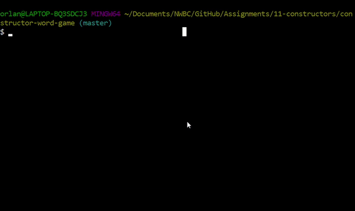

# constructor-word-game
A Node.js Word Guess command-line game using constructor functions and Inquirer NPM installed.

## Gameplay


# NPM Modules Used
* [Inquirer](https://www.npmjs.com/package/inquirer) A collection of common interactive command line user interfaces.
* [Figlet](https://www.npmjs.com/package/figlet) for creating FIGfonts or ASCII art [Check online demo](http://patorjk.com/software/taag/#p=display&f=Graffiti&t=Type%20Something%20)
* [Chalk](https://www.npmjs.com/package/chalk) adds color to the console.

## Constructors and Game Logic 

* **Letter.js** contains the **Letter constructor**. This constructor contains:
    * **`underlyingChar` property** to store the letter of the word.
    * **`guessedChar` property** set to false. If the correct letter was chosen, then this property becomes true.
    * **`showChar` method** shows either the correct letter from `underlyingChar` if `guessedChar` is *true*, otherwise it shows an underscore '_' if `guessedChar` is *false*.
    * **`checkChar` method** - if the correct letter was chosen then it changes `guessedChar` to **true**.

* **Word.js** contains the **Word constructor**. It depends on `Letter.js`. This constructor contains:
    * **`wordObjects` property** stores an array of *Letter objects* representing each letter of a randomly picked word.
    * **`createObjects` method** that splits a word into an array and creates a Letter Object for each element that contains the `underlyingChar` and `guessedChar` properties and stores them in the `wordObjects` array.
    * **`getString` method** calls on  `Letter.getString()` the wordObject, which joins the returned output into an uppercase string. Each letter will be either a letter or an underscore.
    * **`guessChar` method** sends a character to the `Letter.checkChar()` method to determine if the user's guess is correct or not then sets the `guessedChar` to *true* if correct.

* **`index.js`** contains the main logic of the application that depends on `Word.js`.
    * npms used:
        [Inquirer](https://www.npmjs.com/package/inquirer), [Figlet](https://www.npmjs.com/package/figlet), and [Chalk](https://www.npmjs.com/package/chalk).
    * **`wordList` array** contains an array of words.
    * **`game` object** contains the games logic.
        * **`startgame` method** starts the game and resets any previously stored values.
        * **`randomize` method** randomly chooses a word in the `wordList` array.
        * **`displayStatus` method**:
            * refreshes the screen
            * **Figlet** diplays large characters of "Word Guess Game"
            * displays current word in letters and/or dashes.
            * displays guessed letters
            * displays guesses left.
        * **`validInput` method** validates the user input. If it's not a single letter character the user gets feedback saying it's invalid.
        * **`compareInput` method**:
            * calls the Letter.checkChar() method to compare each letter in the current word to the user's letter.
            * If the letter is guessed correctly, the letter object is set to **true** and it is displayed as a letter in the status view.
            * If all the letters are guessed correctly the player wins and calls the `playAgain()` method.
            * If guess is not found then number of guesses is reduced by 1.
            * If guesses reach 0 player loses and calls the `gameOver()` method.
            * Otherwise the player continues playing.
        * **`runInquirer` method** prompts the user for a letter using the `inquirer` module.
        * `playAgain` method prompters the user if they want to play again, with enter being the default YES.
        * **`youWon()` method** tells the player you won and calls the `playAgain()` method.
        * **`gameOver()` method** tells the player you lost, shows the correct word, and calls the `playAgain()` method.
    * **`game.startGame()`** starts the game.


## Programmer's Notes

* .every() [w3schools](https://www.w3schools.com/jsref/jsref_every.asp)
    * If every word letter object is *TRUE* then you win.
    EX:
        `array.object.every(true);`

        ```
        // check if player got all the letters
        if (currentWord.wordObjects.every(function(element) {
            return element.guessedChar;
        })) {
            game.youWon();
            };
        ```

...

* using `.forEach()` for array of objects:
```
function displayStatus(argArray) {
    var displayWordArray = [];      
    argArray.wordObjects.forEach(function(arg) {
        displayWordArray.push(arg.showChar());
        console.log(arg.showChar());
    });
}
```
### Other higher order methods to try:
* .map(), .filter(), .find(), .some(), .every(), .findIndex()

## Other methods to try:

* `%s` string formatting. Ex: `console.log("%s was born last year", (name))`


## Special Characters [w3schools](https://www.w3schools.com/js/js_strings.asp)
* `\t` addes a horizontal tab to a string.
* `console.log('\033[2J');` clears the console.
* 
## Links
* [Text to ASCII Art Generator](http://www.patorjk.com/software/taag/#p=display&f=Graffiti&t=Type%20Something%20) Here is an ASCII Word Art Generator.
    * to show `\` you need to do double backslash, `\\`